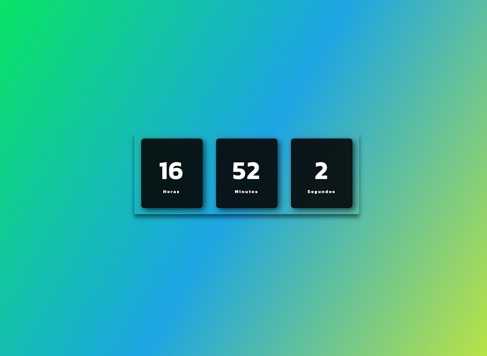

<h1 align="center">DigitalClock </h1>

  <a href="#-tecnologias">Tecnologias</a>&nbsp;&nbsp;&nbsp;|&nbsp;&nbsp;&nbsp;
  <a href="#-projeto">Projeto</a>&nbsp;&nbsp;&nbsp;
 

  

 

## 🔗 My Discord Link

https://eudlayfelipe.github.io/EZDev/

## Project Link

https://eudlayfelipe.github.io/DigitalClock/

## 🚀 Tecnologias

Esse projeto foi desenvolvido com as seguintes tecnologias:

- HTML e CSS

- JavaScript

- Git e Github

## 💻 Projeto

Aprendendo e botando em prática um pouco de JS

---

Feito com ♥ by EudlayFelipe
